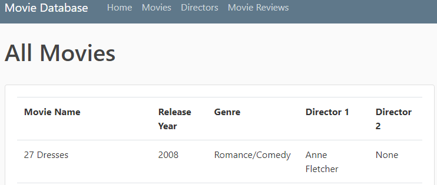
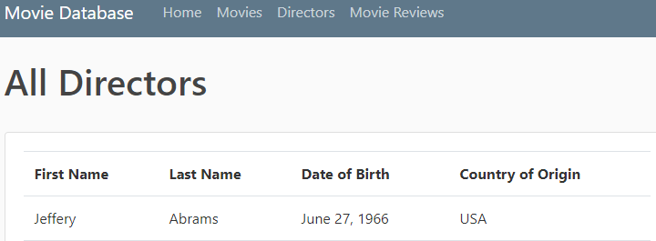
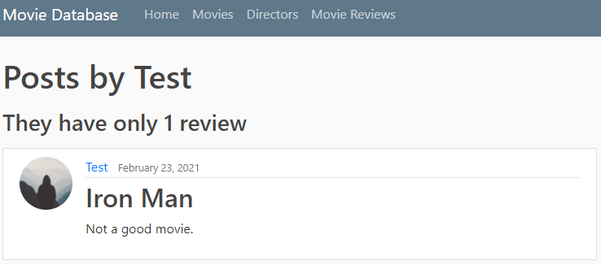

# Movie Database Website

## Purpose

The purpose of this project is to create a simple database for all movies that a user owns. This extends into 2 parts:

* The user will have a record of all movies with practical information like:  
  * What year the movie was released.
  * When what directors were involved in the movie. This particular database.has a slot for two directors but can easily be expanded as needed.
  * Learn basic demographics of the directors such as their date of birth and country of origin.

This database also allows for users to register to the app and post movie reviews.

* A future update will be to include a wau to link the movie referenced to the the post by the user.

## Work Accomplished

* Home Page Created
  * This is where a person first logging onto the app will land.

* Movies Page
  * A link in the top bar links to the movies page where the user can see all movies currently in the database.
  * __Future work__ will be to add a link to the different director's pages.

* Directors tab
  * A link in the top bar links to the directors page where the user can see all directors currently in the database.
  * __Future work__ will be to add a Specific Directors page where we will be able to see all of the movies they have directed.

* Movie Review Page
  * A movie review page was created so that users can write blog/post style comments about movies that are in the database
  * If the user clicks on the user's name then they are linked where they can see all of the different posts made by the user. In this case there is only 1 post for the user _Test_ so at the top the page will show only 1 post made.
  * __Future work__ add functionality where the user can add movie titles to the post so that the user can easily locate it in the database.

## Tools Used

* Python: 3.9.0 _(virtual enviornment used and recommended)_
* MySQL: 8.0.21 _(community edition)_
  * Make sure this is already installed before trying to set up the Django enviornmet or else you will not be able to install the neccessary MySQL Python modules
* [Bootstrap](https://getbootstrap.com/docs/4.0/getting-started/introduction/#starter-template) _(just for styling as styling was not the main focus of this project but may be expanded upon in a future update)_.

#### See the **_requirements.txt_** file to see all python modules needed